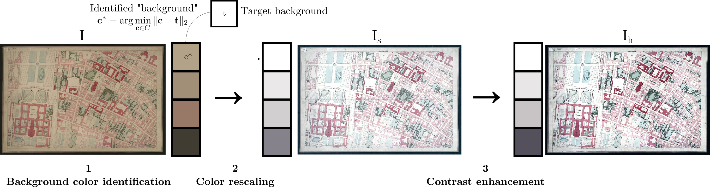

# Super naive colour homogenisation with Imagemagick

A bash script based on Imagemagick for background colour homogenisation of a series of images while preserving colour differences in each image.
Designed as a pre-processing for georeferencing old maps consisting of several scanned sheets.

## Motivations

Many large scale historical maps are a compilation of multiple scans of individual sheets.
Variations in light and ageing of the paper cause the background colour of the scanned images, i.e. the colour of the paper, to vary, resulting in an ugly patchwork effect when these sheets are put together to form the complete plan.
In addition, the paper tends to yellow and the colours fade with time.
It may also be desirable to brighten them up and lighten the background evenly across all the sheets so that they can be used as backgrounds for historical web maps.

## How it works

The main idea is to transform the colors of an image so that its background matches a target color, while preserving the differences between colors within the image as much as possible.

The process consists of three stages, summarised in the diagram below:



Given an input image $I$ and a target background colour $t$:

1. $I$ is quantised to extract a set $C$ of dominant colours from the image. and the colour $`c^* = \arg\min_{c \in C} \| c - t \|_2`$ is chosen as the background colour of the image;
2. Colours of the image $I$ are rescaled by a factor $`(\frac{t_{l}}{c^*_{l}},\frac{t_{a}}{c^*_{a}},\frac{t_{b}}{c^*_{b}})`$ ;
3. A sigmoïdal contrast enhancement is eventually applied to produce $I_h$ the final homogenized image. See [https://imagemagick.org/script/command-line-options.php?#sigmoidal-contrast](https://imagemagick.org/script/command-line-options.php?#sigmoidal-contrast) for more info.

Notes:

- calculations are made in the CIELAB colour space. The difference between two colours is the Euclidean distance between them: $`d_E = \| .\|_2`$.
- Step 2 assumes that the background colour is dominant in the image. If not, a background colour can be set with the `--background-reference` option.

## Usage

[ImageMagick library](https://imagemagick.org/script/download.php) v6.x or higher is required.
On Linux:

```bash
apt install imagemagick
convert --version # Or `magick --version` if ImageMAgick >= 7.0
# Should be at least 6.x
```

Tool usage:

```bash
Usage: ./equalisation.sh [options] file1 [file2 ...]

Required:
  -t, --target <r,g,b>                Target background color (default: 255,255,255)

Optional:
  -v, --verbose                       Show more information about the process
  -c, --contrast <value>              Contrast enhancement value (default: 0). See ImageMagick's 'Sigmoidal Non-linearity Contrast'.
  -b, --background-reference <r,g,b>  Reference background color (default: 255,255,255). You typically don't want to set this parameter manually unless you really know what you are doing.
  -h, --help                          Display this help message
```

Note: equalised images will be written to `./output/`

## Example

```bash
./equalisation.sh -c 5,70% -t 255,255,255 -v example/*.jpg
```
