# How Not-So-Naive Map Colour Homogenisation works

`homog` takes scans of old map sheets and makes their paper white, evenly across each sheet and
across sheets, while keeping inks and watercolour washes as they were drawn. This report explains
how. Each section opens with a plain-language summary (in a quote block) and then gives the model,
with links to the code that implements it.

**Contents**

1. [The problem](#1-the-problem)
2. [Colour spaces in a nutshell](#2-colour-spaces-in-a-nutshell)
3. [Reading the scans](#3-reading-the-scans)
4. [Where is the sheet?](#4-where-is-the-sheet)
5. [What colour is the paper?](#5-what-colour-is-the-paper)
6. [Uneven lighting: the paper surface](#6-uneven-lighting-the-paper-surface)
7. [White balance: Bradford chromatic adaptation](#7-white-balance-bradford-chromatic-adaptation)
8. [Seams between sheets](#8-seams-between-sheets)
9. [The full-resolution pass](#9-the-full-resolution-pass)
10. [Checking the result: debug images and calibration](#10-checking-the-result-debug-images-and-calibration)
11. [Results on the example atlas](#11-results-on-the-example-atlas)
12. [Limitations](#12-limitations)
13. [What was tried and abandoned](#13-what-was-tried-and-abandoned)
14. [References](#14-references)

---

## 1. The problem

> **In short.** "Large old maps come in many sheets, scanned one by one. Each sheet has its own
> yellowed paper, lit a little differently by the scanner, and darker towards its edges. Once the
> sheets are put together, the map looks like a patchwork. We want white paper everywhere, without
> washing out the pale colours painted on it."

A sheet of a manuscript or engraved map is paper, aged to a yellowish beige, covered with ink lines
and, often, transparent watercolour washes (gardens, water, built-up areas). Its scan mixes three
things: the colour of the paper, the colours drawn on it, and the lighting of the scanner, which is
never perfectly even (vignetting, darker edges, folds).

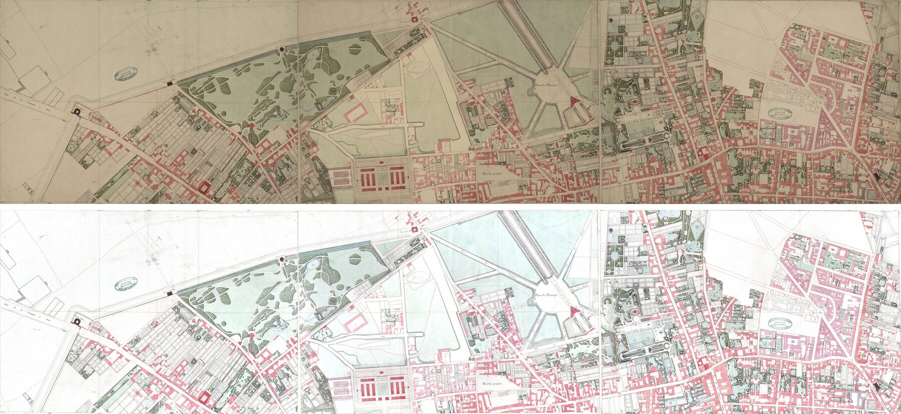

*Three adjacent sheets of the example, cropped at their neatline and put side by side without any
resampling: as scanned (top), and corrected by `homog` (bottom).*

The goal is to make the paper the target colour (white by default) **everywhere**: within each
sheet, and on both sides of the edge between two sheets, while changing the drawn colours as little
as possible. Three difficulties:

- pale washes are close to the paper colour, and a naive correction bleaches them;
- the lighting varies within a sheet, so a single paper colour per sheet is not enough;
- the paper is darker close to the edges of a sheet, exactly where two sheets meet.

The pipeline:

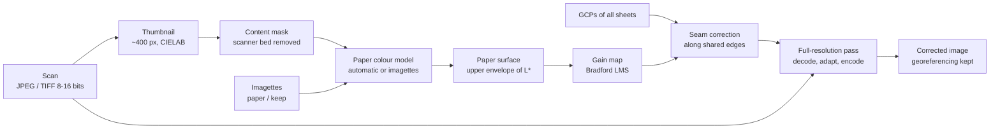

Everything is estimated on reduced images; only the last step touches the full-resolution pixels,
once ([`src/lib.rs`](../src/lib.rs)).

## 2. Colour spaces in a nutshell

> **In short.** "A pixel value is not a quantity of light: it is compressed for display. To reason
> about light we first undo this compression. To reason about how different two colours *look*, we
> use a space designed for it, CIELAB. To change the colour of the light, we work in a space that
> mimics the cones of the eye."

Three spaces are used ([`src/color.rs`](../src/color.rs)):

- **Linear sRGB.** Scans are sRGB-encoded (or converted to it, see §3). The sRGB transfer function
  is undone to get values proportional to light [[IEC 1999](#ref-srgb)]. Products and sums of light
  (averages, gains) are computed there.
- **CIELAB** [[CIE 2004](#ref-cie)]. $`L^{\ast}`$ is the perceived lightness (0 black, 100 white), $`a^{\ast}`$ the
  green–red axis, $`b^{\ast}`$ the blue–yellow axis. Euclidean distances approximate perceived differences:
  $`\Delta E = \lVert \mathrm{Lab}_1 - \mathrm{Lab}_2 \rVert`$, about 1 for a just noticeable difference, a few units for
  a clearly visible one. Aged paper is typically around $`L^{\ast} \approx 72`$, $`b^{\ast} \approx 16`$.
- **Bradford cone space (LMS).** A linear transform of XYZ, $`\mathbf{lms} = M_{B}\,\mathbf{xyz}`$, whose axes behave
  like the long, medium and short wavelength cones; used for the white balance (§7).

## 3. Reading the scans

> **In short.** "Any image GDAL can read. If the scan carries a colour profile, it is honoured.
> The analysis works on small versions of the image; the big one is read only once, at the end."

Images are read with GDAL ([`src/io.rs`](../src/io.rs)): RGB or RGBA, 8 or 16 bits, JPEG, TIFF,
GeoTIFF, PNG… An embedded ICC profile is converted to linear sRGB with Little CMS (relative
colorimetric intent); without profile, data are taken as sRGB.

Two reduced versions are read, box-averaged by GDAL (JPEG files are decoded at a reduced scale
directly, which makes these reads cheap):

| Image | Largest side | Used for |
| --- | --- | --- |
| thumbnail | 400 px | content mask, paper model, paper surface |
| reduced image | 1600 px | seam measurements, debug images |

## 4. Where is the sheet?

> **In short.** "Scans often show the scanner bed around the sheet, sometimes a colour chart or a
> ruler. These must not be taken for paper. The bed is the uniform colour that touches the border
> of the image; we remove it and keep the biggest piece left: the sheet."

The bed colour is the median of the border pixels of the thumbnail. A flood fill from the border
marks as background every pixel connected to it whose colour is within $`\Delta E \lt  15`$ of the bed.
Among the remaining pixels, only the largest 4-connected region is kept, which drops charts or
rulers lying on the bed ([`content_mask`](../src/background.rs)).

Three guards cover the scans without bed:

- the "bed" covers more than 60 % of the image: the scan is cropped to the map, everything is content;
- the largest region is smaller than 30 % of the image: the border colour was a grid of ink lines
  touching the border, which cut the sheet into cells, so everything is content;
- the bed colour is within $`\Delta E \lt  10`$ of the estimated paper colour: it was paper touching the
  border, so everything is content.

The mask only restricts where the paper is *estimated*; the correction is applied to the whole image.

## 5. What colour is the paper?

> **In short.** "On an old map, bare paper is the lightest material: ink and transparent washes can
> only darken it. So the paper is the dominant colour among the lightest pixels. When this rule
> fails, the user shows the tool a small crop of paper, or of a colour that is not paper."

**Automatic estimate.** Among the content pixels of the thumbnail, keep those whose lightness lies
between the 75th and 98th percentiles of $`L^{\ast}`$, then those within 6 $`a^{\ast}b^{\ast}`$ units of their median
chroma ([`auto_paper`](../src/background.rs)). The paper colour $`\mathbf{p}`$ is their median Lab.

**Colour model.** A set of pixels is summarised by a robust model
([`ColourModel`](../src/hints.rs)): median centre $`\mu`$, chroma spread $`\sigma_{ab}`$ and lightness spread
$`\sigma_{L}`$,

```math
$$\sigma_{ab} = \max\!\left(\sigma_{\min},\ \frac{\mathrm{median}_i \lVert (a_i, b_i) - (\mu_a, \mu_b) \rVert}{1.1774}\right),
\qquad
\sigma_{L} = 1.4826\ \mathrm{median}_i \lvert L_i - \mu_L \rvert$$
```

(1.1774 is the median distance to the centre of a 2-D normal distribution, in standard deviations;
1.4826 turns a median absolute deviation into a standard deviation). A pixel is **compatible with
the paper** if its chroma is within 3.5 spreads of the paper chroma, and its lightness within
$`[-\max(15, 3\sigma_{L}),\ +\max(10, 2\sigma_{L})]`$ of it: lightness varies with the lighting, chroma much less.
For the automatic model, $`\sigma_{\min} = 8/3.5`$, so that paper within 8 $`\Delta E`$ in chroma is always accepted.

**Imagettes.** What only the user knows is given as small crops of the scans (at least 10 × 10 px),
one example per file ([`Hints`](../src/hints.rs)):

- `paper/`: bare paper. The paper model becomes the set of these models ($`\sigma_{\min} = 1.5`$), and
  $`\mathbf{p}`$ the median of the matching pixels;
- `keep/`: colours that must never be taken for paper, such as a pale tint close to the paper colour.
  A pixel within 3 spreads in chroma and $`\max(15, 3\sigma_{L})`$ in lightness of such a model is excluded
  from every paper estimate ($`\sigma_{\min} = 1`$).

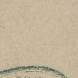

*An imagette of paper cropped from a sheet (160 × 160 px). The few pixels of the stamp it contains
do not matter: the model is a median.*

## 6. Uneven lighting: the paper surface

> **In short.** "The paper is not equally light everywhere: the scanner lights the centre better
> than the corners. Instead of one paper colour, we fit a smooth surface that follows the lightest
> pixels, like a sheet laid on top of the image. Being smooth, it cannot sink into a wash, however
> large: the washes keep their colour."

The paper colour is modelled as three polynomial surfaces over the thumbnail, one per Lab channel,
of degree $`d`$ (3 by default; `lighting = even` → 2, `uneven` → 4, `none` → a single colour). With
coordinates normalised to $`[-1, 1]`$ and monomials $`\phi(x, y) = (x^{i} y^{j})_{i + j \le d}`$:

```math
\hat{L}(x, y) = \beta_L^{\top} \phi(x, y), \quad
\hat{a}(x, y) = \beta_a^{\top} \phi(x, y), \quad
\hat{b}(x, y) = \beta_b^{\top} \phi(x, y)
```

fitted on the pixels compatible with the paper (§5) ([`paper_surface`](../src/background.rs)).

**Lightness: an upper envelope.** Bare paper is the lightest material, washes and inks are below it.
$`\hat{L}`$ is therefore fitted as the 80 % quantile of $`L^{\ast}`$ rather than its mean, by quantile regression
[[Koenker 1978](#ref-koenker)]:

```math
\beta_L = \arg\min_{\beta} \sum_i \rho_{\tau}\!\left(L_i - \beta^{\top}\phi_i\right),
\qquad
\rho_{\tau}(r) = \begin{cases} \tau\, r & r > 0 \\ (\tau - 1)\, r & r \le 0 \end{cases},
\qquad \tau = 0.8
```

solved by iteratively reweighted least squares (30 iterations, weights $`\tau / \max(\lvert r_i \rvert, 0.05)`$ above
the surface and $`(1-\tau)/\max(\lvert r_i \rvert, 0.05)`$ below), each step by normal equations and a Cholesky
decomposition.

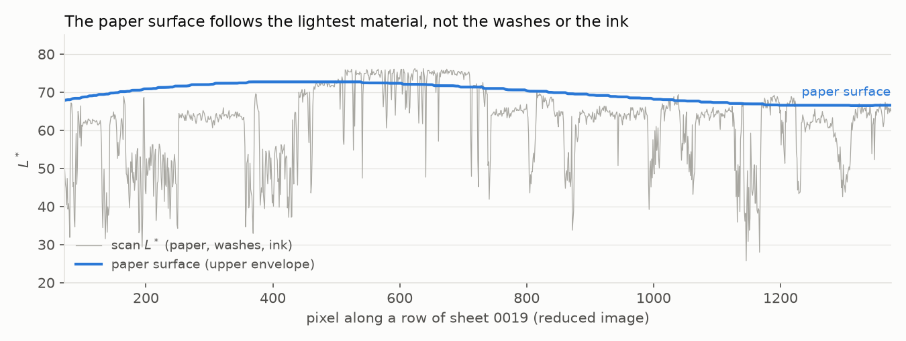

*$`L^{\ast}`$ along a row of sheet 0019 (grey) and the fitted surface (blue). The plateaus around 63 are
green washes (lawns): they stay below the surface and are not taken for paper.*

**Chroma: bare paper only.** $`\hat{a}`$, $`\hat{b}`$ are fitted on the compatible pixels at most 4 $`L^{\ast}`$ units below
the envelope, by least squares with Tukey biweights [[Beaton 1974](#ref-tukey)] on the chroma residual,
starting from the global paper chroma:

```math
w_i = \left(1 - u_i^2\right)^2 \ \text{if } u_i < 1,\ 0 \text{ otherwise},
\qquad u_i = \frac{\lVert (a_i, b_i) - (\hat{a}, \hat{b})(x_i, y_i) \rVert}{3}
```

(10 iterations). Pixels of another hue than the paper (a pale green wash as light as the paper)
get a zero weight.

A surface of degree 3 has 10 coefficients per channel: it can follow vignetting and yellowed edges
but not the outline of a wash. If too few pixels are compatible, the surface falls back to the
single paper colour. Outside the sheet, $`\hat{L}`$ is clamped to $`[\max(L_p - 30, 5),\ 100]`$ to keep the
extrapolation sane.

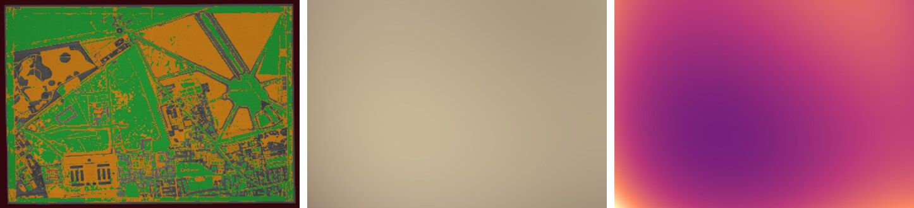

*Sheet 0019: pixels used for the fit (green: bare paper, used for $`L^{\ast}`$ and $`a^{\ast}b^{\ast}`$; orange: washes,
used for the envelope only; grey: ink, ignored; dark red: scanner bed), the estimated paper colour,
and the luminance gain of the correction (from ×2.1 in the centre to ×4.2 in a corner).*

## 7. White balance: Bradford chromatic adaptation

> **In short.** "Yellowed paper under scanner light looks like white paper under a yellowish light.
> So we do what the eye and cameras do: we change the colour of the light so that the paper becomes
> white. All the colours follow consistently; black stays black."

The paper is treated as the white of a scene lit by an unknown illuminant, and the image is
adapted to the target white $`\mathbf{t}`$ with a von Kries transform [[von Kries 1902](#ref-vonkries)] in the
Bradford cone space [[Lam 1985](#ref-lam)]. For a pixel of linear sRGB $`\mathbf{c}`$ at $`(x, y)`$, with
$`\mathbf{p}(x, y)`$ the paper surface converted to XYZ:

```math
$$\mathbf{c}' = M^{-1}\, \mathrm{diag}\!\left(\frac{M_B\, \mathbf{t}_{XYZ}}{M_B\, \mathbf{p}_{XYZ}(x, y)}\right) M\, \mathbf{c},\qquad M = M_B\, M_{\mathrm{sRGB} \to \mathrm{XYZ}}$$
```

([`src/transform.rs`](../src/transform.rs)). Properties:

- the paper becomes exactly $`\mathbf{t}`$;
- black stays black (the transform is linear);
- greys of the paper's tint (pencil, faded ink) become neutral;
- other colours keep their relation to the paper: a wash looks as it would on white paper, within
  about 2 $`\Delta E`$ for saturated colours (von Kries is an approximation for them [[Fairchild 2013](#ref-fairchild)]).

The three gains $`M_B \mathbf{t} / M_B \mathbf{p}(x, y)`$ are computed on the thumbnail grid: the *gain map*.

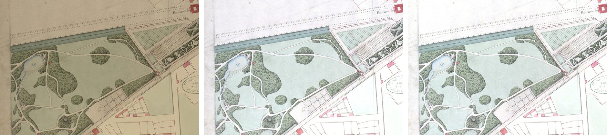

*A park of sheet 0019: as scanned; with a single paper colour (`lighting = none`): the paper stays
grey in the corners; with the paper surface: the paper is white and the lawns stay green.*

## 8. Seams between sheets

> **In short.** "The surface is too smooth to follow the darkening right at the edge of a sheet,
> and that is exactly where two sheets meet. Using the control points of the georeferencing, we find
> which sheets touch, look at the paper in a thin band along each shared edge, and add a correction
> there that fades inwards. The images are not warped: the control points only tell where the edges are."

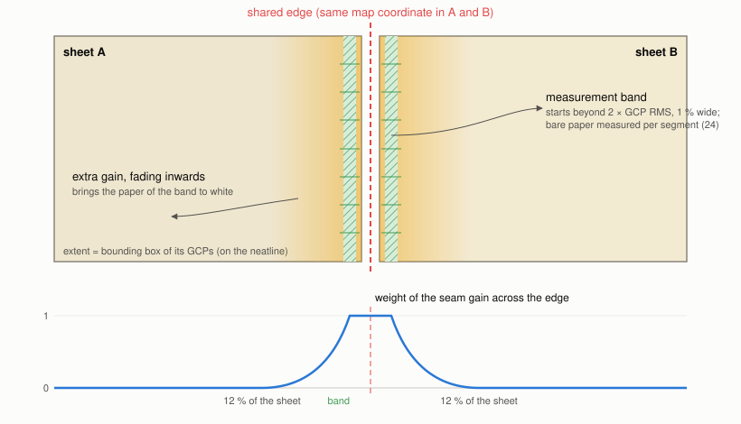

**Layout.** Each sheet comes with ground control points (GCPs) in a QGIS georeferencer `.points`
file ([`src/layout.rs`](../src/layout.rs)). An affine transform map ↔ pixel is fitted on them (least
squares on centred coordinates), with $`\mathrm{RMS}`$ its residual in map units. The extent of the sheet is
the bounding box of its GCPs, which are placed on the neatline. Two sheets share an edge when their
extents touch along a side (tolerance 1 % of the sheet size). All the `.points` files of the
directory are used, so a sheet gets the same correction whether its neighbours are processed in the
same run or not.

**Measurement.** Along each shared edge, the corrected colours (§7) are sampled on the reduced image
in a band starting at $`\max(0.3\,\%,\ 2\,\mathrm{RMS})`$ from the edge (beyond the neatline drawing and the
GCP inaccuracy), 1 % of the sheet size wide: 400 positions along the edge × 8 across
([`EdgeField::measure`](../src/seams.rs)). A sample is bare paper if, after correction, its chroma is
within $`\max(4,\ 2\sigma_{ab})`$ of the target, its lightness above $`L_t - 20`$, and its scanned colour matches no
`keep` imagette. The edge is cut into 24 segments; in each segment with at least 10 paper samples,
the gain bringing their median to the target is

```math
\mathbf{g}_k = \log \frac{M_B\, \mathbf{t}_{XYZ}}{\mathrm{median}_{i \in k} \mathbf{lms}_i}
```

Segments without paper are interpolated, then the profile is smoothed (moving average over 3 segments).

**Correction.** At a pixel at distance $`\delta`$ inside the edge and position $`u`$ along it, the extra
log-gain is $`w(\delta)\,\mathbf{g}(u)`$, with

```math
w(\delta) = \begin{cases} 1 & \delta \le \delta_m \\ \left(1 - \dfrac{\delta - \delta_m}{R - \delta_m}\right)^2 & \delta_m < \delta < R \\ 0 & \delta \ge R \end{cases}
```

where $`\delta_m`$ is the middle of the band and $`R`$ = 12 % of the sheet size. Near a corner, two edges
measure the same darkening: their contributions are averaged rather than added,
$`\sum_e w_e \mathbf{g}_e / \max(1, \sum_e w_e)`$. The extra gain multiplies the gain map (§7), so it costs nothing in the
full-resolution pass.

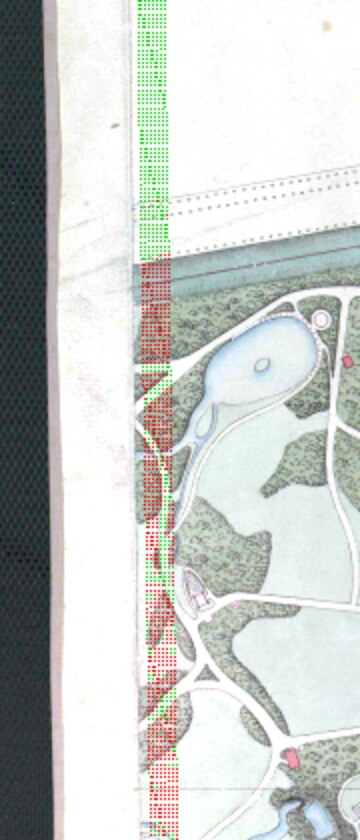

*Measurement band along the west edge of sheet 0019: green samples are taken as paper, red ones
(woods, lawns, roads) are rejected.*

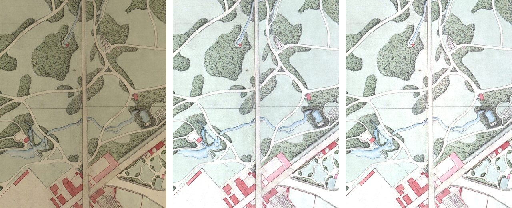

*The seam between sheets 0017 and 0019, at full resolution, without resampling: as scanned; with the
paper surface only (the left side stays greyer); with the seam correction.*

## 9. The full-resolution pass

> **In short.** "Everything so far was computed on small images. The big image is now read once, by
> horizontal strips, and each pixel is corrected with a few multiplications, on all processor cores."

([`src/lib.rs`](../src/lib.rs), [`src/transform.rs`](../src/transform.rs))

- The image is read by strips of about 64 MB (pixel-interleaved RasterIO); memory stays bounded
  whatever the size of the scan.
- Per pixel: decoding by a lookup table (or the ICC transform), product by $`M`$, the three gains
  bilinearly interpolated from the gain map, product by $`M^{-1}`$, sRGB encoding by a table indexed by
  $`\sqrt{c}`$ with linear interpolation (error below half a 16-bit code value).
- Rows are processed in parallel (rayon); several files too.
- Output: same format family as the input (or `--format`), same bit depth, alpha kept. TIFF outputs
  are tiled 512 × 512 and compressed. Geotransform, CRS, GCPs, nodata and colour interpretation are
  copied; EXIF tags, which describe the original file, are not.

A 5800 × 4000 JPEG sheet takes 0.5 s (0.6 s with seams) on 20 threads, most of it JPEG decoding and
encoding.

## 10. Checking the result: debug images and calibration

> **In short.** "The tool shows its work: what it took for paper, how much it brightens each area,
> where it measured the seams. For a whole batch, it tells which sheets look suspicious."

**Debug images** (`--debug`, [`src/debug.rs`](../src/debug.rs)): per sheet, the reduced original, the paper
surface, the pixels used for the fit, the luminance gains of the surface and of the seams, the seam
measurement points and the result, with the numbers in `debug.txt`.

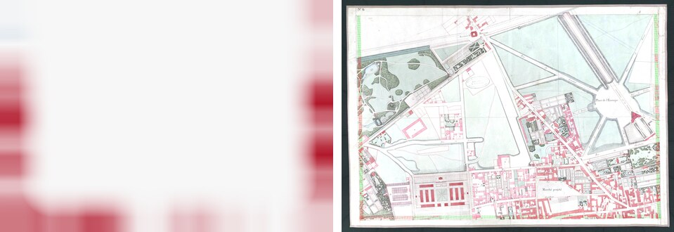

*Sheet 0019: luminance gain of the seam correction (red: lighter, up to +38 % along the edges shared
with three neighbours), and the result with the measurement points.*

**Calibration** (`homog calibrate`, [`src/calibrate.rs`](../src/calibrate.rs)): analyses a batch without
writing images and produces a contact sheet (original | pixels taken for paper | result), a report
and a proposed `homog.toml`. A sheet is flagged when its paper colour is more than 6 $`\Delta E`$ from the
median of the batch, or when less than 15 % of its pixels are bare paper.

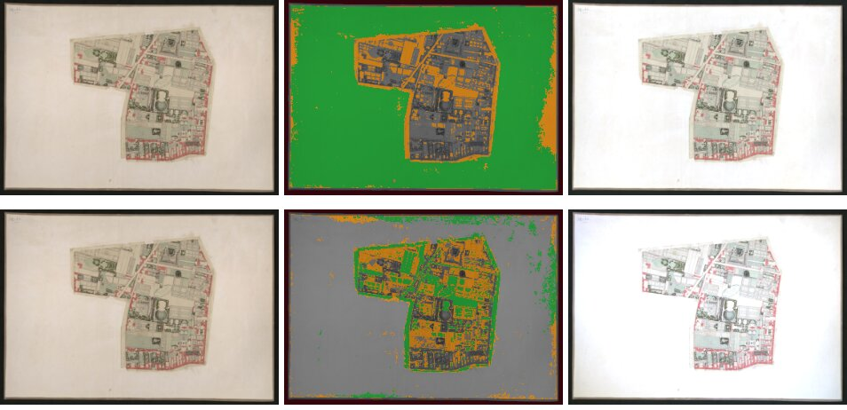

*A map fragment pasted on a white board. Top: the board is taken for paper (green), the map keeps
its beige paper. Bottom: with an imagette of the map's paper, the board is ignored (grey) and the
map becomes white.*

## 11. Results on the example atlas

Measured on sheets 0017, 0019 and 0021 (`example/`), on both sides of their two seams, over pairs of
points mirrored across the edge showing the same material:

| | Paper at seam 0017 \| 0019 | Paper at seam 0019 \| 0021 |
| --- | --- | --- |
| As scanned (global paper colours of the sheets) | 3.3 $`\Delta E`$ | 3.8 $`\Delta E`$ |
| Paper surface only | 3.6 $`\Delta E`$ (95.4 \| 98.9 $`L^{\ast}`$) | 3.5 $`\Delta E`$ (97.0 \| 93.5 $`L^{\ast}`$) |
| With seam correction | **0.3 $`\Delta E`$** (99.1 \| 99.4 $`L^{\ast}`$) | **0.1 $`\Delta E`$** (99.0 \| 98.9 $`L^{\ast}`$) |

The paper surface makes each sheet white in its interior but not at its edges; the seam correction
closes the gap. Washes still differ by 1–1.5 $`\Delta E`$ across the seams: the sheets were painted by hand,
separately.

Within the sheets, compared with a single paper colour per sheet (`lighting = none`):

| Sheet | Paper $`L^{\ast}`$, darkest blocks (min / 10th pct.), single colour | Same, surface + seams | Wash chroma kept |
| --- | --- | --- | --- |
| 0017 | 90.2 / 95.3 | 97.6 / 98.7 | 89 % |
| 0019 | 92.4 / 95.7 | 92.5 / 98.8 | 100 % |
| 0021 | 89.7 / 93.7 | 97.6 / 98.3 | 94 % |

(Paper $`L^{\ast}`$: 90th percentile of the paper-hued pixels in each block of an 8 × 8 grid; wash chroma:
mean chroma of the light, non-paper-hued pixels, relative to the single-colour rendering, which
cannot bleach them.)

On the 59 GCP-referenced sheets of the atlas, `homog` runs in 9 s and `homog calibrate` in 4 s.

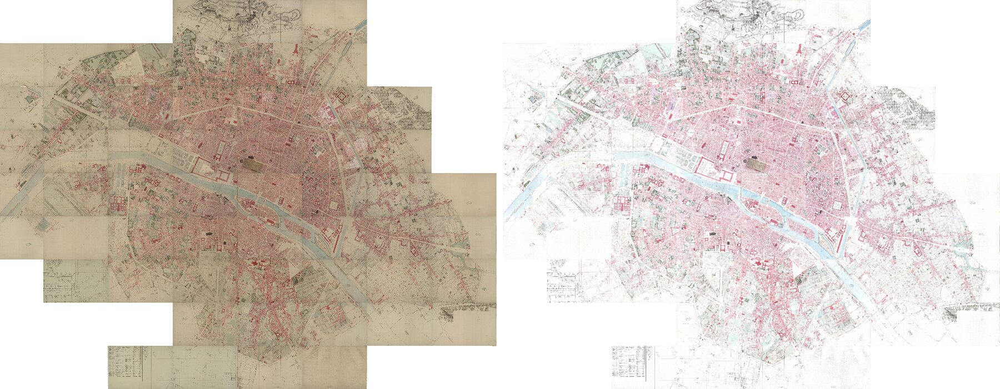

*57 sheets assembled with GDAL using their GCPs, for illustration only (`homog` does not resample):
as scanned (left) and corrected (right), with one `paper` imagette for the fragment of §10.*

## 12. Limitations

- **Paper must be the lightest material.** Opaque body colour or white highlights lighter than the
  paper, or a paper darker than large flat tints, mislead the automatic estimate: `paper` or `keep`
  imagettes fix it.
- **Imagettes apply to the whole project**, which is right when the sheets share the same paper.
- **Colours lighter than the local paper** are clipped to the target.
- **Saturated colours** are adapted approximately (von Kries), within about 2 $`\Delta E`$.
- **Sheet extents are the bounding boxes of their GCPs**: sheets whose GCPs are not on the neatline
  get an approximate extent, hence no or partial seam correction.
- **Washes and inks are not harmonised across sheets**, only the paper.

## 13. What was tried and abandoned

| Approach | Why it was abandoned |
| --- | --- |
| Scaling the CIELAB channels as stored by ImageMagick ($`a^{\ast}`$, $`b^{\ast}`$ offset by 0.5), the original shell script | Not a scaling but a biased shift: neutral inks turned bluish ($`b^{\ast} \approx -14`$). |
| Flat-field by Gaussian smoothing of the paper pixels | Large pale washes were taken for paper and bleached (52 % of their chroma lost on sheet 0017). |
| Per-sheet colour matrix fitted on colour pairs across seams | No measurable improvement; the mismatch at seams was the paper lightness at the edges. |
| Matching ink clusters (k-means) between sheets | Made things worse on non-adjacent sheets. |
| Per-sheet degree of the surface by cross-validation | Changed the result from sheet to sheet without measurable gain. |
| Fading distance of the seam correction measured on each edge | No gain over a fixed 12 %. |

## 14. References

<a id="ref-tukey"></a>**[Beaton 1974]** A. E. Beaton, J. W. Tukey. The fitting of power series, meaning
polynomials, illustrated on band-spectroscopic data. *Technometrics* 16(2), 147–185, 1974.

<a id="ref-cie"></a>**[CIE 2004]** CIE 15:2004, *Colorimetry*, 3rd edition. Commission Internationale de
l'Éclairage, 2004.

<a id="ref-fairchild"></a>**[Fairchild 2013]** M. D. Fairchild. *Color Appearance Models*, 3rd edition.
Wiley, 2013.

<a id="ref-srgb"></a>**[IEC 1999]** IEC 61966-2-1:1999, *Multimedia systems and equipment – Colour
measurement and management – Part 2-1: Default RGB colour space – sRGB*.

<a id="ref-koenker"></a>**[Koenker 1978]** R. Koenker, G. Bassett. Regression quantiles. *Econometrica*
46(1), 33–50, 1978.

<a id="ref-lam"></a>**[Lam 1985]** K. M. Lam. *Metamerism and colour constancy*. PhD thesis, University
of Bradford, 1985.

<a id="ref-vonkries"></a>**[von Kries 1902]** J. von Kries. Chromatische Adaptation. *Festschrift der
Albrecht-Ludwigs-Universität*, Freiburg, 1902.

Software: [GDAL](https://gdal.org) (raster I/O), [Little CMS](https://www.littlecms.com) (ICC profiles),
[rayon](https://github.com/rayon-rs/rayon) (parallelism).
